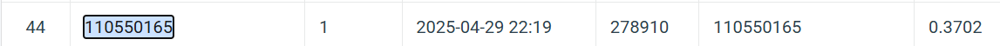

# Cell Segmentation Project

This project implements a Mask R-CNN model using PyTorch for cell instance segmentation in biomedical images. It includes data loading, training, validation, and inference steps, providing a complete workflow for cell detection and segmentation.


## Installation

Ensure you have the required packages by installing them via:

```bash
pip install -r requirements.txt
```

## Dataset Structure

Organize your dataset as follows:

```
dataset/
├── train/
│   ├── image1
│   │   ├──image.tif
│   │   ├── class1.tif
│   │   ├── class2.tif
│   │   ├── class3.tif
│   │   └── class4.tif
│   ...
├── test_release/
│   ├── image1.tif
│   ├── image2.tif
│   ...
│
└── test_image_name_to_ids.json
```

## Usage

Run the main training script:

```bash
python HW3.py
```

Make sure to set the correct paths for your training, testing, and image ID map in the `main()` function.

## Results


